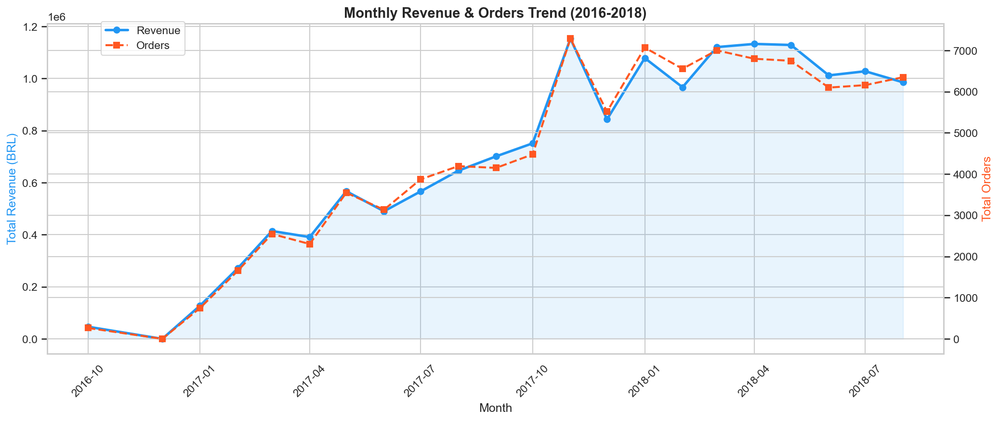
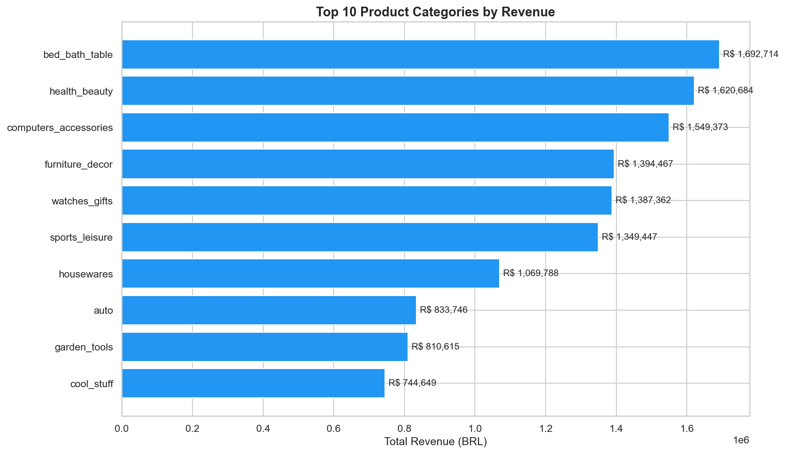
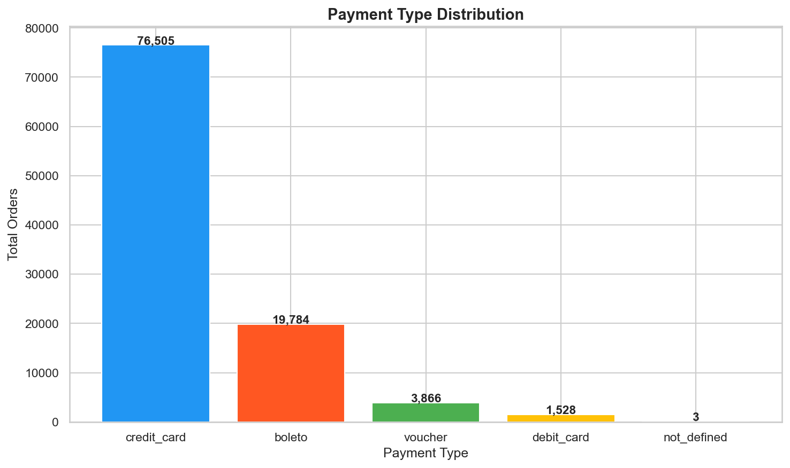
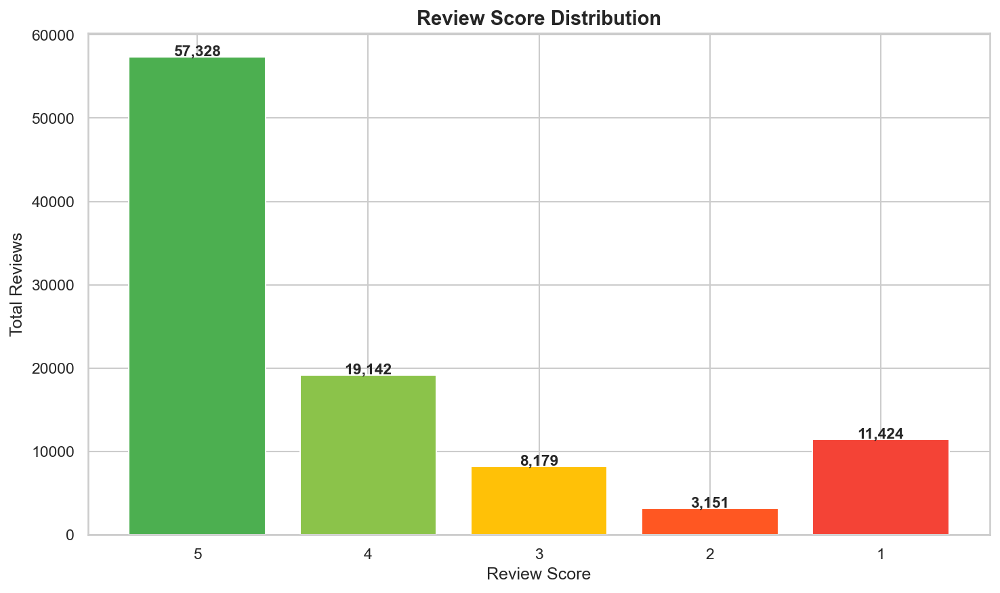

# 🛒 Olist E-Commerce Sales Analysis

## Project Overview
Analysis of 100,000+ orders from Brazil's largest e-commerce platform (Olist) 
to identify revenue trends, customer behavior, and business insights.

## Dataset
- **Source:** [Kaggle - Brazilian E-Commerce](https://www.kaggle.com/datasets/olistbr/brazilian-ecommerce)
- **Period:** October 2016 – August 2018
- **Size:** 99,441 orders, 8 tables

## Tools Used
- **PostgreSQL** — Data extraction & analysis
- **Python** (Pandas, Matplotlib, Seaborn) — Data processing & visualization

## Key Findings
| Analysis | Finding |
|---|---|
| Revenue Growth | 24x growth from Oct 2016 to Apr 2018 |
| Top Category | Bed & Bath — R$ 1.69M revenue |
| Delivery Time | Average 12.56 days, 11 days ahead of estimate |
| Payment Method | 75% orders via credit card, avg 3.5 installments |
| Customer Satisfaction | 77% rated 4-5 stars |
| Geographic Concentration | SP state accounts for 42% of all customers |

## SQL Analyses
1. Monthly Revenue Trend
2. Top 10 Product Categories by Revenue
3. Order Status Breakdown
4. Average Delivery Time
5. Top 10 Sellers by Revenue
6. Customer Distribution by State
7. Payment Type Analysis
8. Review Score Distribution

## Charts

